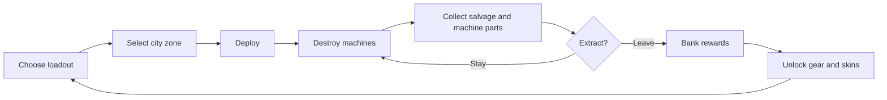
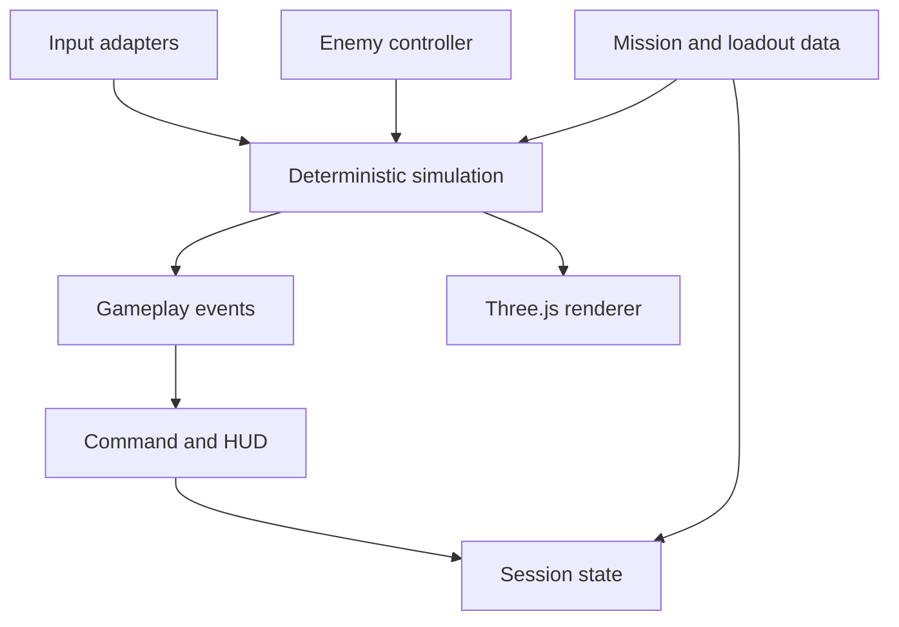

# Earthfall Protocol

## Game Design Document — Web Prototype v0.1

**Genre:** single-player extraction shooter prototype  
**Platform:** desktop and mobile web; static deployment on GitHub Pages  
**Perspective:** elevated third-person / isometric for the prototype  
**Business model:** free-to-play with direct-purchase cosmetic skins only  
**Rating target:** provisional PEGI 16, with Violence, Horror, and In-Game Purchases descriptors  
**Prototype fantasy:** deploy into a recognizable city district, dismantle an alien robot force, and escape with the salvage before the area is overrun.

> Earthfall Protocol is an original IP. It may draw on broad survival-science-fiction and extraction-shooter ideas, but it must not use Gantz names, characters, suits, weapons, iconography, story text, or recognizable visual designs.

## 1. Product vision

Alien carrier ships have appeared over Earth. Their occupants never communicate; they deploy autonomous machines that transform occupied city blocks into harvesting zones. A decentralized human defense network sends contracted operatives into those zones to destroy machine relays, recover alien salvage, and extract before the carrier reinforces the area.

The game should make real places feel temporarily occupied by something unknowable. The fantasy is not military conquest. It is a tense, short incursion into a familiar space where the player must decide how long to stay and how much loot to risk.

### Design pillars

1. **Recognizable places, altered stakes.** Missions use real-world landmarks and street plans as inspiration. Silhouettes, signage, scale, and routes should make the location readable even when prototype geometry is simple.
2. **Prepare, commit, escape.** Equipment choices happen before deployment. Money only becomes permanent after a successful extraction.
3. **Readable robots, escalating pressure.** Every robot communicates intent through silhouette, color, movement, and sound. Difficulty comes from combinations and positioning rather than hidden stat inflation.
4. **Gameplay before art.** Capsules, cubes, spheres, flat colors, and procedural effects are acceptable. Renderer, visuals, input, rules, and AI are separate systems so presentation can be replaced later.
5. **Cosmetics without manipulation.** Skins do not affect power. Items are sold directly, with their exact appearance and price visible. No paid random items, loot boxes, expiring offers, or pay-to-win upgrades.

## 2. Audience and content rating

The intended audience is players aged 16+ who enjoy short, replayable PvE missions, build planning, risk/reward decisions, and science-fiction horror.

PEGI 16 is a design target, not a guaranteed classification. The game avoids human gore and dismemberment: robots spark, fracture, and collapse into geometric parts. The 16 target comes from intense sustained invasion-horror, realistic urban combat framing, and the desired tone. If the final presentation remains non-realistic, a rating submission may receive PEGI 12 instead. Direct skin sales still require the **In-Game Purchases** descriptor; they do not by themselves guarantee PEGI 16.

## 3. Core loop

### Session target

- Command and loadout: 30–90 seconds.
- Mission: 4–8 minutes in the first public prototype.
- Debrief and next choice: under 30 seconds.
- A first-time player should understand the objective within 15 seconds of deployment.

### Risk and reward

- Destroyed robots drop salvage spheres and recoverable machine parts.
- Salvage and parts carried during a mission are **unsecured**.
- Reaching extraction banks salvage as account credits and adds recovered parts to the player's inventory.
- Failure loses unsecured salvage and parts but never removes previously banked currency, equipment, or purchased cosmetics.
- Later versions can offer optional side objectives that increase rewards and threat without making the primary objective unclear.

## 4. Player experience flow

### 4.1 Command view

The main screen presents Earth as the primary object, not as dashboard decoration. Occupied cities appear as warning nodes. Selecting one opens a mission preview with:

- real city and district name;
- threat level and robot composition;
- primary objective;
- estimated duration;
- reward range;
- a small geometry-first district preview;
- loadout summary and deploy action.

The information hierarchy is inspired by Helldivers 2's readable mission preview, but the visual language, layout, terminology, and assets must be original.

### 4.2 Loadout

The player's machine is assembled from four functional slots. Each slot accepts one owned part, and the combined assembly determines mission stats:

The loadout interface presents the complete humanoid machine as an interactive technical schematic. Selecting its head, arm assembly, torso core, or legs opens the compatible owned and recoverable parts for that physical region.

The deployed player model mirrors the equipped assembly. Each slot has its own low-poly geometry, silhouette, and issued/Hunter/Sentry accent treatment, while the selected frame finish colors the shared armor shell. These visual substitutions do not alter the player's collision footprint, facing axis, or combat timing.

| Slot | Function | Prototype examples |
| --- | --- | --- |
| Head | Targeting and weapon range | Scout optic, Hunter visor, Sentry array |
| Arms | Weapon, damage, magazine, and reload profile | Arc arms, Pulse arms, Hunter repeaters, Sentry cannon |
| Core | Integrity and armor | Carbon core, Sentry bulwark |
| Legs | Movement speed | Runner legs, Hunter striders |

Issued parts provide a complete starter build. Hostile machine parts must be collected in the mission and successfully extracted before they can be equipped. Duplicate parts are retained in the inventory as a visible collection count. Three frame finishes remain cosmetic only: Carbon shell, Salvage white, and Signal red.

### 4.3 Mission

The first zone is **Praça da Sé, São Paulo, Brazil**, represented as an original low-poly combat space inspired by its broad plaza, steps, streets, and dense surrounding buildings. It is not a photogrammetric copy.

Prototype objective sequence:

1. Arrive inside the quarantine perimeter.
2. Destroy invading robots while replacements continue entering the zone.
3. Collect the salvage they drop and decide how long to remain exposed.
4. Reach any active extraction field at any time.
5. Hold the extraction command until transfer completes. Destroying eight robots remains the displayed combat objective, but is not required to leave.

### 4.4 Debrief

Show robots destroyed, unsecured salvage collected, parts recovered or lost, extraction result, credits banked, and a clear return-to-command action. A failed run should invite another attempt without shame or friction.

## 5. Combat

### Controls

| Action | Desktop | Touch prototype |
| --- | --- | --- |
| Move | WASD or arrow keys | Floating movement stick |
| Aim | Mouse position on ground | Movement stick direction |
| Fire | Hold/click left mouse | Hold FIRE |
| Reload | R | RELOAD button |
| Extract | Hold E in extraction field | Hold EXTRACT |
| Pause | Escape | Pause button |

### Feel goals

- Input-to-shot feedback must be immediate.
- Hits use a short tracer, impact flash, robot color response, and light camera shake.
- Pickup feedback rises from the recovered item's world position; extraction progress is communicated by the field ring and beam rather than a global status banner.
- The player must be able to distinguish taking damage from dealing damage without reading numbers.
- Reload state, ammunition, health, carried salvage, and extraction progress are always visible. Part recovery is announced immediately and summarized during debrief.
- Obstacles block movement and create useful combat lanes.

### Initial balance

| Parameter | Arc rifle | Pulse carbine |
| --- | ---: | ---: |
| Magazine | 12 | 24 |
| Damage | 42 | 24 |
| Shot interval | 0.30 s | 0.13 s |
| Reload | 1.25 s | 1.55 s |

The player has 100 health. A mission contains eight required kills. The prototype timer is 180 seconds. These are tuning values, not architectural constants.

## 6. Robots and future AI

### Prototype behaviors

| Robot | Shape language | Behavior | Counterplay |
| --- | --- | --- | --- |
| Hunter | Capsule body, red sensor | Chases, stops at attack range, fires bursts | Keep distance and use cover |
| Sentry | Wider body, amber sensor | Holds lanes and fires slower heavy shots | Flank or burst it down |

Rule-based AI uses a small state model: **patrol → acquire → pursue/position → attack → destroyed**. Perception, decision, locomotion, aiming, and weapon execution must be separate interfaces.

### Learned-agent path

Later robots may be controlled by trained policies comparable in ambition to Arc Raiders' believable machine behavior. The game client must not directly embed training logic. A future `EnemyController` adapter should be able to receive observations and return high-level actions while the deterministic simulation remains authoritative.

Recommended observation groups:

- self position, velocity, health, cooldowns;
- player last-known position and visibility;
- nearby allies, obstacles, cover points, extraction state;
- mission phase and local threat budget.

Recommended action groups:

- target point / movement intent;
- aim direction;
- fire, disengage, investigate, coordinate;
- ability selection for later robot classes.

Training, evaluation, safety constraints, and online inference are out of scope for the first prototype.

## 7. Mission and world structure

### Launch locations

| City | Zone | Status | Environmental hook |
| --- | --- | --- | --- |
| São Paulo | Praça da Sé | Playable prototype | Broad plaza, dense perimeter, relay ship overhead |
| Tokyo | Shibuya Crossing | Playable prototype | Intersections, screens, vertical sightlines |
| Cairo | Tahrir Square | Preview only | Open approaches, heat haze, long-range sentries |
| Paris | Place de la République | Preview only | Monument focal point and concentric pressure |

Using a real place requires a source and rights review before commercial release. Street data, signage, trademarks, building interiors, and scanned assets must have appropriate licenses. The prototype uses hand-authored abstractions.

### Mission model

Each mission is data-driven:

- location identity and coordinates;
- district geometry source;
- time of day and weather;
- objective graph;
- spawn zones and threat budget;
- robot roster;
- reward table;
- extraction positions;
- rating and accessibility flags.

This lets later missions reuse combat systems while changing spatial problems.

## 8. Progression and economy

### Earned currency

Credits are banked only on extraction and may unlock utility equipment and non-premium cosmetics. Functional machine parts are earned from defeated enemies and secured only by extraction. Prices should create visible short-term goals without forcing grind.

### Cosmetic store principles

- Skins change visuals only.
- Every purchase is direct and shows the exact item.
- No random paid rewards.
- No time-limited pressure, countdown pricing, or punitive streak systems.
- Default items remain visually complete and desirable.
- Prices are displayed in real currency at the final store layer; the prototype only demonstrates selection.
- Parental controls and platform purchase confirmation are required before release.

## 9. Visual and audio direction

### Prototype geometry language

- Player: an original low-poly humanoid mecha assembled from head, arms, core, and legs regions.
- Standard enemies: capsules with box armor and distinct sensors.
- Armor and sensors: boxes.
- Cover, buildings, vehicles: cubes and rectangular prisms.
- Salvage and mission beacons: spheres and rings.
- Projectiles and fire lines: simple lines or emissive spheres.

Color does system work:

- cyan: player, navigation, safe interaction;
- amber: warning and sentry intent;
- red: active hostile pressure;
- green: extraction and secured reward;
- neutral charcoal: city and interface structure.

### Replacement-ready rendering

Gameplay code refers to semantic entities and events, not mesh children. A renderer maps `Player`, `Enemy`, `Pickup`, `Obstacle`, and `ExtractionZone` state to Three.js objects. Replacing the low-poly player assembly with a rigged model must not change combat rules.

### Audio

Prototype audio may use generated oscillators and noise. Later audio layers should include weapon identity, robot intent, impact confirmation, extraction escalation, and urban ambience. Never use copyrighted anime or game audio.

## 10. Technical design

### Prototype stack

- TypeScript, React, Three.js, Vite/Vinext.
- No backend required.
- LocalStorage for prototype credits and settings only.
- Static GitHub Pages export with relative asset paths.
- Mouse, keyboard, and basic touch controls.

### System boundaries

Required seams:

- `InputAdapter`: keyboard/mouse or touch intentions.
- `EnemyController`: current rules or future learned policy.
- `MissionDefinition`: location, objectives, spawn budget, rewards.
- `GameSimulation`: authoritative combat and extraction rules.
- `GameRenderer`: geometry and effects only.
- `ProgressionStore`: local prototype storage; replaceable by backend later.

## 11. Accessibility and usability

- Do not rely on color alone; pair state colors with icons, labels, motion, or shapes.
- Maintain readable text contrast over the mission view.
- Allow reduced motion through the operating-system preference.
- Provide keyboard-accessible command and loadout screens.
- Do not trigger gameplay audio until the player interacts.
- Later milestones: remapping, aim assistance options, screen shake slider, subtitle controls, and color-vision presets.

## 12. Prototype scope

### Included in v0.1

- command globe with four city nodes;
- playable São Paulo and Tokyo missions;
- two selectable weapons;
- three previewable suit finishes;
- two rule-based robot archetypes;
- objective, salvage, extraction, success/failure, and banked credits;
- desktop and basic touch controls;
- static GitHub Pages build.

### Explicitly excluded

- multiplayer and networking;
- real-money checkout;
- account system or cloud saves;
- trained enemy policies;
- production maps, models, animation, audio, or localization;
- live-service events, battle passes, daily rewards, loot boxes;
- final PEGI submission.

## 13. Acceptance criteria

The v0.1 prototype is done when:

1. A new player can choose equipment, select São Paulo, deploy, destroy eight robots, collect salvage, extract, see the debrief, and return to command without a dead end.
2. Failing a mission never banks unsecured salvage.
3. Succeeding banks the exact shown reward and persists it after reload.
4. Both weapons have observably different cadence, magazine, reload, and damage.
5. The selected skin changes only player presentation.
6. Desktop controls and basic touch controls complete the full loop.
7. Extraction is available from deployment, and destroying an enemy replenishes the active enemy population.
8. All game assets are original geometry/code or appropriately licensed.
9. The site builds with no TypeScript, lint, or production-build errors and the static export works from a nested GitHub Pages path.
10. No gameplay rule depends on a specific mesh, material name, or current rule-based AI implementation.

## 14. Milestones after v0.1

1. **Feel pass:** camera, impact, robot telegraphs, audio, and tuning.
2. **Location pass:** higher-fidelity São Paulo layout and a documented geodata/licensing pipeline.
3. **Extraction depth:** optional objectives, escalating reinforcements, equipment loss rules.
4. **Robot roster:** support, artillery, ambush, and boss machines.
5. **AI research sandbox:** deterministic observation/action interface, offline training environment, evaluation maps.
6. **Co-op architecture:** server-authoritative simulation, parties, matchmaking, reconnects, anti-cheat.
7. **Commerce and compliance:** direct cosmetics store, parental tools, privacy, platform rules, and formal ratings submission.

## 15. Quality bars for the Gauntlet Loop

The terminal agent should judge actual rendered output and playable behavior against these concrete bars:

- **Loop bar:** a first-time tester can complete one full extraction loop in 4–8 minutes without written help or a stuck state.
- **Command-view bar:** at a glance, the player can identify selected city, threat, objective, reward, loadout, and deploy action; compare hierarchy with the supplied Helldivers 2 mission-preview reference without copying its art or layout.
- **Combat bar:** input, aiming, hit confirmation, enemy intent, damage, reload, pickups, and extraction are readable without console logs.
- **Engineering bar:** `npm run lint`, the hosted production build, and `npm run build:pages` pass; page export works below a repository subpath.
- **Originality bar:** no protected Gantz names, assets, characters, suit designs, or copied text appear anywhere in the product.

## 16. Research basis

- [How to Run a Gauntlet Loop](https://somethingbig.ai/gauntlet-loop) — goal-first decomposition, concrete quality bars, independent critics, artifact inspection, and repeated improvement.
- [OpenAI Codex best practices](https://developers.openai.com/codex/learn/best-practices) — prompts structured around goal, context, constraints, and a verifiable definition of done.
- [Running long-horizon tasks with Codex](https://developers.openai.com/blog/run-long-horizon-tasks-with-codex) — milestone checks, stop-and-fix validation, and a durable progress record.
- [Official PEGI label criteria](https://pegi.info/what-do-the-labels-mean) — age-rating and interactive-risk guidance, including the In-Game Purchases descriptor.
